# Amazon Bedrock Workshop v2.0

This hands-on workshop, aimed at developers and solution builders, introduces how to leverage foundation models (FMs) through [Amazon Bedrock](https://aws.amazon.com/bedrock/).

Amazon Bedrock is a fully managed service that provides access to FMs from third-party providers and Amazon; available via an API. With Bedrock, you can choose from a variety of models to find the one that’s best suited for your use case.

Within this series of labs, you'll explore some of the most common usage patterns we are seeing with our customers for Generative AI. We will show techniques for generating text and images, creating value for organizations by improving productivity. This is achieved by leveraging foundation models to help in composing emails, summarizing text, answering questions, building chatbots, and creating images. You will gain hands-on experience implementing these patterns via Bedrock APIs and SDKs, as well as open-source software like [LangChain](https://python.langchain.com/docs/get_started/introduction) and [FAISS](https://faiss.ai/index.html).

Labs include:

- **Text Generation**  
- **Text Summarization**  
- **Questions Answering**  
- **Chatbot**  
- **Image Generation**  
- **Code Generation**  
- **Agents (function calling)**
- **Entity Extraction**
- **Chatbot Guardrails** 


## Getting started

### Create a notebook environment

You can run this workshop in the **us-east-1 (N. Virginia)** region or any other region where Bedrock models are enabled. If you encounter any problems with access to Bedrock models, please visit the **AWS Console -> Bedrock -> Model access** page to verify if every model is enabled. If not, you need to click **Manage model access** and enable the required models. The below description assumes that the necessary models are enabled in us-east-1 region.

For a fully-managed environment with rich AI/ML features, we'd recommend using [SageMaker Studio](https://aws.amazon.com/sagemaker/studio/). To get started quickly, you can refer to the [instructions for domain quick setup](https://docs.aws.amazon.com/sagemaker/latest/dg/onboard-quick-start.html) or do the below steps.

> ℹ️ **Note:** SageMaker domain can be created in any region, not necessarily us-east-1. However if SageMaker is running in another region (say, eu-central-1), you will need to configure the region in all your scripts which are using bedrock client library. By default the region is the same as your SageMaker instance. In case SageMaker is in another region and Bedrock models are enabled in us-east-1, you will have to explicitly set the region to us-east-1, so that SageMaker's scripts would use Bedrock in us-east-1.

First of all go to SageMaker -> Domains and click "Create domain":

<div align="center">
    
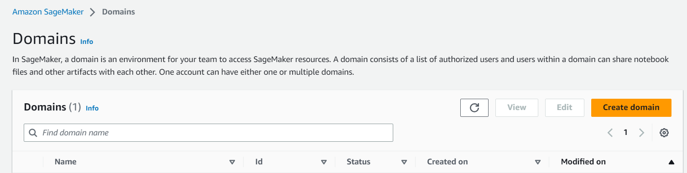

</div>

Then select the option "Set up for single user (Quick Setup)":

<div align="center">
    
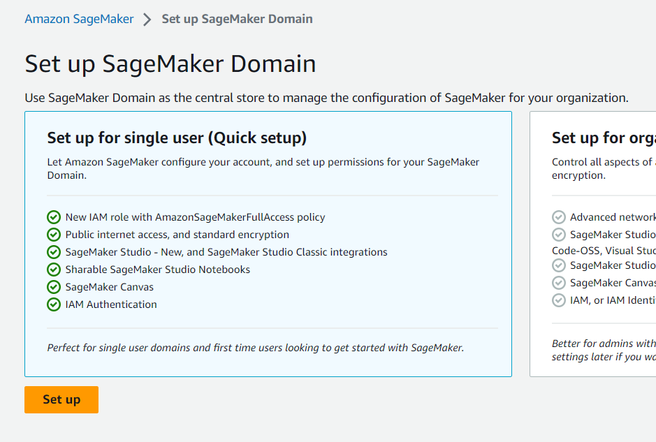

</div>

Now you have to wait a few minutes for domain to be created for you. When the domain is in progress, you should see the below message:

<div align="center">
    
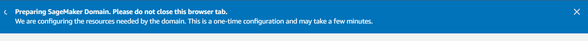

</div>

Once the domain is ready (you might need to refresh the window) you will see the User profiles list under the domain with the default user created:

<div align="center">
    
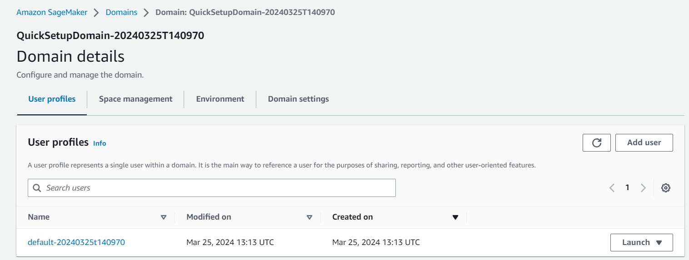

</div>

Click "Launch" and select "Studio":
 
<div align="center">
    
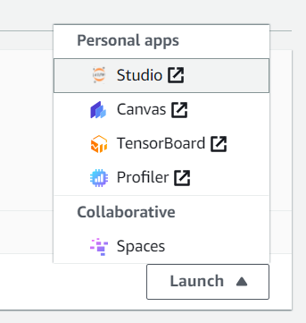

</div>

Once the Studio is up and running please select the "Studio Classic" icon on the left hand side of the screen (the last one):

<div align="center">
    
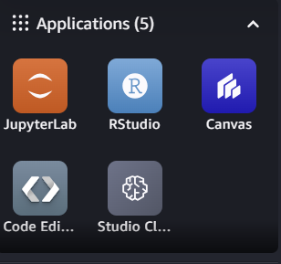

</div>

You will see that your instance is not running:

<div align="center">
    
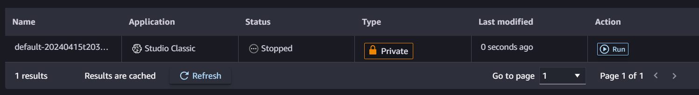

</div>

Now click Run and wait a few minutes - the instance is created for you:

<div align="center">
    
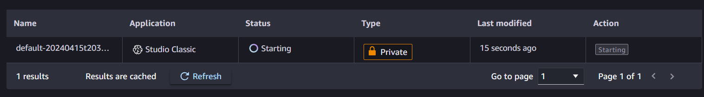

</div>

Once it's ready, you will see buttons Stop and Open. Click Open to open the Studio Classic:

<div align="center">
    
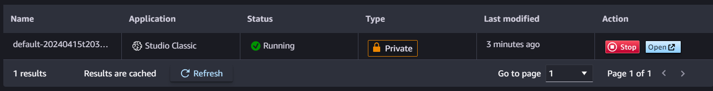

</div>

### Clone and use the notebooks

Once your notebook environment is set up, clone this workshop repository into it using Terminal:

<div align="center">
    
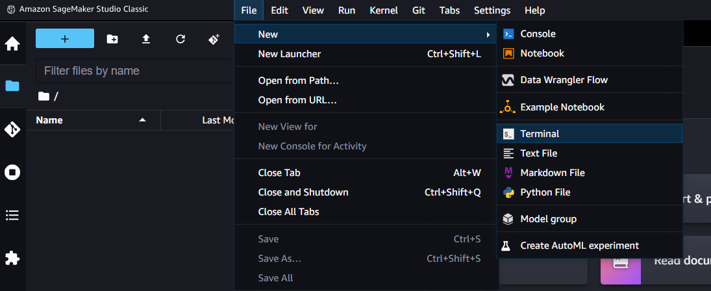

</div>

> ℹ️ **Note:** In SageMaker Studio, you can open a "System Terminal" to run these commands by clicking *File > New > Terminal*

Now run the below commands in terminal, one by one:

```sh
sudo yum install -y unzip
git clone https://github.com/kkakolpgs/amazon-bedrock-workshop
cd amazon-bedrock-workshop
git checkout v2.0
```
INFO: Last command switched to `v2.0` branch. On this branch is current version of the workshop materials.

You should see then the list of files on the left hand side of the screen:

<div align="center">
    
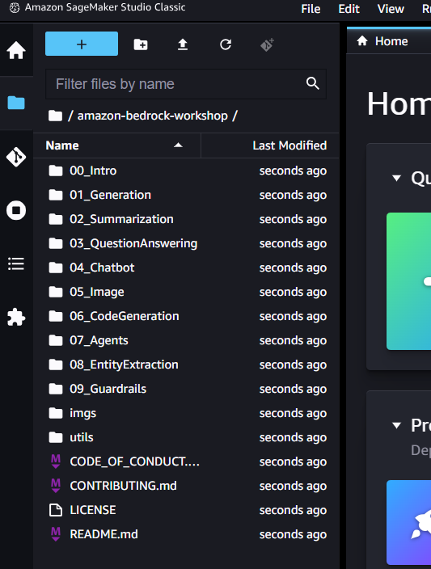 

</div>

### Enable AWS IAM permissions for Bedrock

The AWS identity you assume from your notebook environment (which is the [*Studio/notebook Execution Role*](https://docs.aws.amazon.com/sagemaker/latest/dg/sagemaker-roles.html) from SageMaker, or could be a role or IAM User for self-managed notebooks), must have sufficient [AWS IAM permissions](https://docs.aws.amazon.com/IAM/latest/UserGuide/access_policies.html) to call the Amazon Bedrock service.

To grant Bedrock access to your identity, you can:

Open the [AWS IAM Console](https://us-east-1.console.aws.amazon.com/iam/home?#) and find your [Role](https://us-east-1.console.aws.amazon.com/iamv2/home?#/roles) (if using SageMaker or otherwise assuming an IAM Role), or else [User](https://us-east-1.console.aws.amazon.com/iamv2/home?#/users)


> ℹ️ **Note:** If using default SageMaker setup, your role will look like 'AmazonSageMaker-ExecutionRole-YYYYMMDDTHHMMSS'

<div align="center">
    
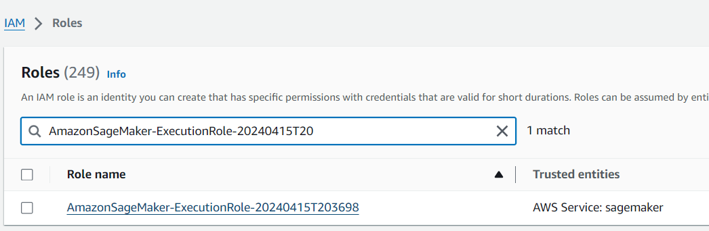

</div>


Select *Add Permissions > Create Inline Policy* to attach new inline permissions:

<div align="center">
    
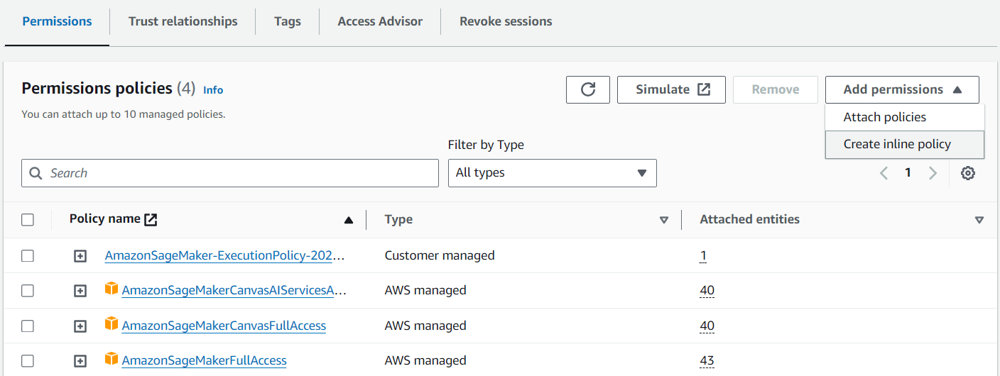

</div>

Open the *JSON* editor and paste in the below example policy:

```
{
    "Version": "2012-10-17",
    "Statement": [
        {
            "Sid": "BedrockFullAccess",
            "Effect": "Allow",
            "Action": ["bedrock:*"],
            "Resource": "*"
        }
    ]
}
```

<div align="center">
    
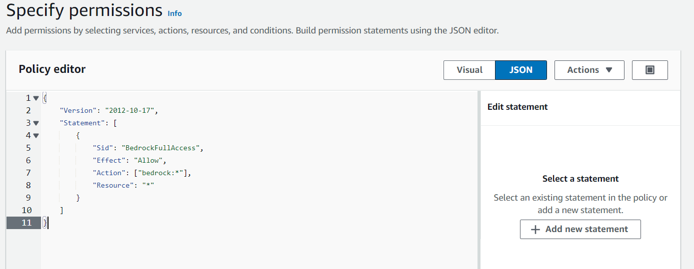

</div>

Insert any policy name you like and save by clicking Create policy:

<div align="center">
    
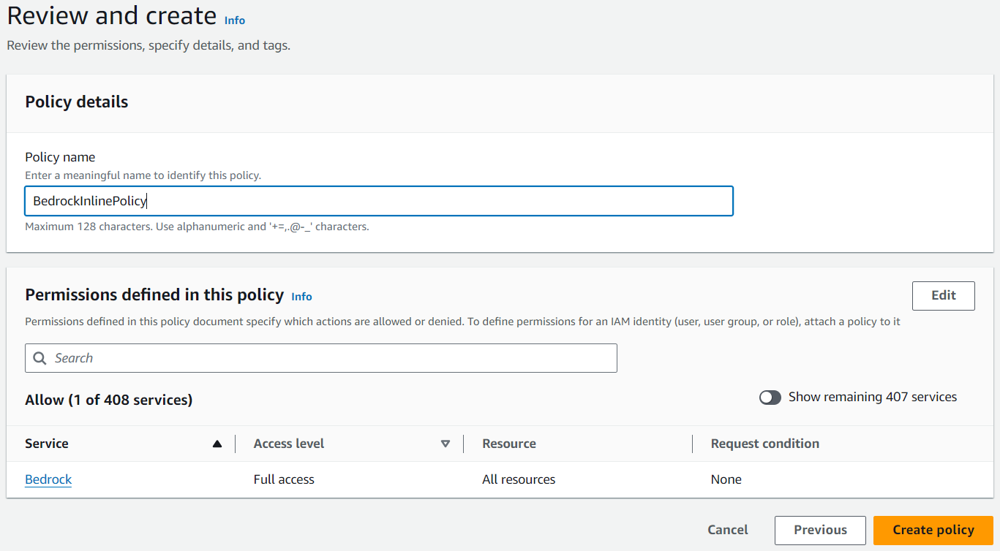

</div>

Repeate these steps to add a policy for Amazon OpenSearch Service. The required policy is presented below:

```
{
    "Version": "2012-10-17",
    "Statement": [
        {
            "Sid": "AOSSAccess",
            "Effect": "Allow",
            "Action": [  "aoss:*" ],
            "Resource": "*"
        }
    ]
}
```

First click Attach inline policy (like before) and paste the above policy:

<div align="center">
    
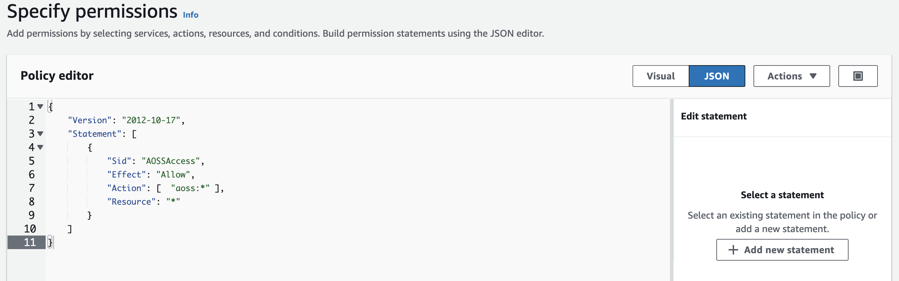

</div>

Insert any policy name you like and save by clicking Create policy:

<div align="center">
    
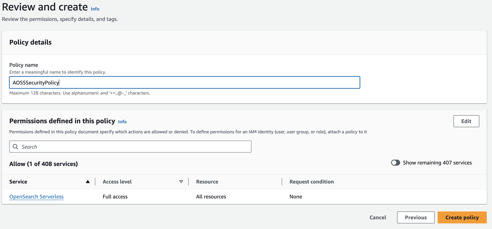

</div>

> ⚠️ **Note:** With Amazon SageMaker, your notebook execution role will typically be *separate* from the user or role that you log in to the AWS Console with. If you'd like to explore the AWS Console for Amazon Bedrock, you'll need to grant permissions to your Console user/role too.

For more information on the fine-grained action and resource permissions in Bedrock, check out the Bedrock Developer Guide.

## Workshop flow

This workshop is presented as a series of **Python notebooks**, which you can run from the environment created above (or your local environment but we don't recommend it since it would require some additional work on local Python environment which can be challenging).

After all the above setup you're ready to explore the lab notebooks! Start with [00_Intro/bedrock_boto3_setup.ipynb](00_Intro/bedrock_boto3_setup.ipynb) for details on how to install the Bedrock SDKs, create a client, and start calling the APIs from Python.

Then open the numbered chapters and explore all the notebooks in every chapter.

**Have fun!**

## Important information

To save money, please shutdown your SageMaker machine every time you finish your work (assuming you want to continue it the next day or even later). Please go to File menu and click Shutdown:

<div align="center">
    
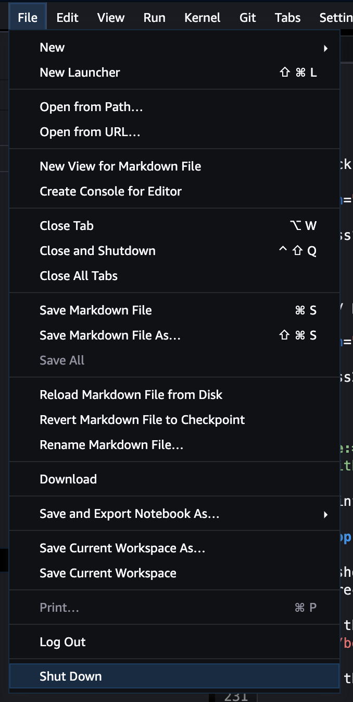


</div>

Then click Shutdown Server (if you wish to come back - then in the SageMaker studio window the machine will be stopped and you will need to click Run again) or Shutdown All (if you do not intend to come back and that's the end of your work):

<div align="center">
    
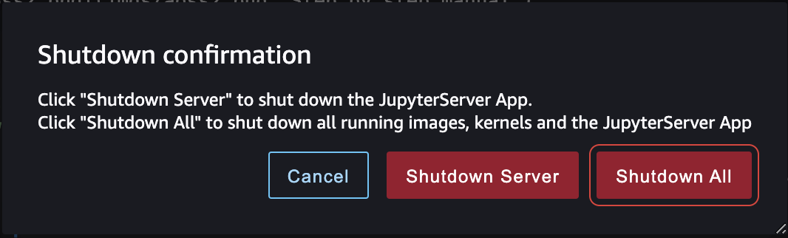

</div>
  
## After workshop

After finishing workshop, please remove your SageMaker domain:
- open your Studio Classic instance and click File -> Shutdown All
- in AWS Console go into SageMaker -> Domains -> \[select your domain\] -> \[select your user profile\] 
- click 'Edit' (still in your user details) and then 'Delete user'
- return to Domains, check your domain and click 'Edit', and then 'Delete domain'
